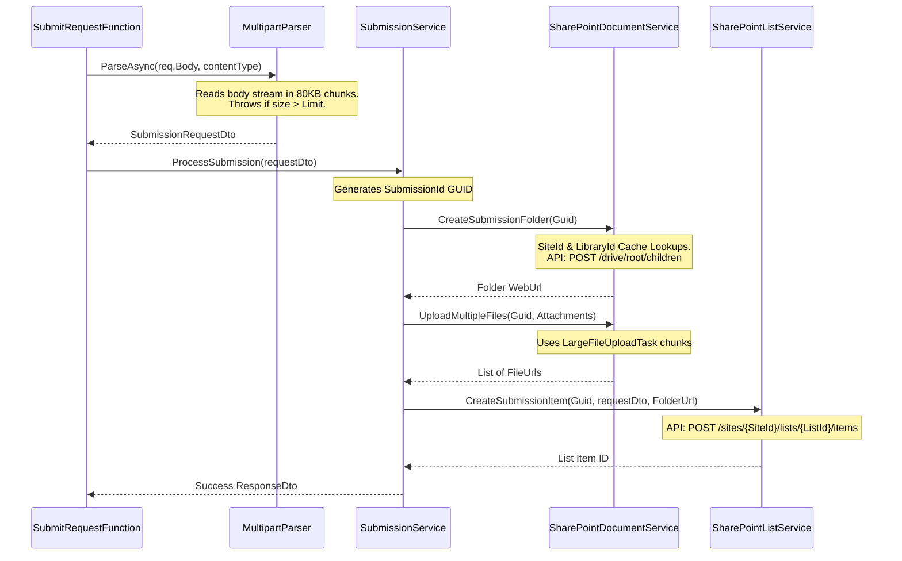

# Architectural & Workflow Guide: Outlook Request Submission System

This guide explains the entire system design, technology stack, security/authentication mechanisms, and step-by-step execution flow of the Request Submission application. It is written to be accessible to a layperson while retaining the technical depth required for developers.

---

## 🌟 Section 1: Plain English Overview (How It Works)

Imagine a user working in Microsoft Outlook who wants to submit a support request or project files to the company's SharePoint site. 

```text
[ Outlook User Interface ] 
      │ 
      ▼ (Clicks Submit)
[ Task Pane Add-In (Frontend) ] ────(HTTP POST: Form Fields + Attachments)───► [ Azure Function (Backend) ]
                                                                                       │
                                                                         ┌─────────────┴─────────────┐
                                                                         ▼                           ▼
                                                             [ SharePoint Library ]         [ SharePoint List ]
                                                             (Files in GUID Folder)         (Record & Link)
```

1.  **Filling out the Form**: The user opens the custom **Enterprise Submit Hub** add-in directly within Outlook. They fill in their Name, Email, Department, and Description, and select up to 5 attachments (like PDFs, Excel sheets, or images).
2.  **Sending the Data**: When they click **Submit**, the frontend bundle packages all text entries and attachments into a single HTTP request packet and sends it securely to our serverless backend (Azure Function).
3.  **Processing & Storage (The "Double Save")**:
    *   **The Folder**: The backend generates a unique identification code (a **GUID**, like `a1b2c3d4-e5f6...`). It tells SharePoint to create a folder with this ID in the Document Library and uploads all files inside it.
    *   **The List**: Once the files are uploaded, SharePoint returns the web link to that folder. The backend then records the user's details (Name, Email, Description) along with the folder link as a single entry (row) in a SharePoint List.
4.  **Completion**: The backend returns a success message to the frontend, which displays a confirmation to the user. If any step fails, the backend cleans up after itself by deleting the folder so no orphaned files are left behind.

---

## 🛠️ Section 2: Technical Architecture & Core Technologies

The system is split into a client-side frontend and a server-side serverless backend:

| Layer | Component / Technology | Responsibility |
| :--- | :--- | :--- |
| **Frontend** | Office.js, HTML5, Vanilla CSS, JS | Renders the task pane in Outlook, collects form inputs/files, and dispatches HTTP requests. |
| **Backend** | Azure Functions (.NET 8 Isolated Worker) | Host environment that exposes APIs and handles backend triggers. |
| **Auth** | Azure.Identity / MS Entra ID | Authenticates the backend to call Office 365 services securely. |
| **Graph API** | Microsoft Graph SDK v5 | SDK used to interface with SharePoint Libraries and Lists. |
| **Storage** | SharePoint Online | Houses the uploaded files (Drive/Library) and metadata records (List). |

### Data Transmission Specs:
*   **HTTP Method**: `POST`
*   **Endpoint**: `/api/submit` (running on `http://localhost:7071` locally).
*   **Content-Type**: `multipart/form-data; boundary=----WebKitFormBoundary...`
    *   *Why?* Standard JSON requests cannot easily transmit raw binary files alongside structured text fields. Using `multipart/form-data` allows files and text strings to be split into "parts" separated by a boundary string in a single request body.

---

## 📂 Section 3: Detailed File-by-File Explorer

Here is a map of the repository's files, explaining why each exists, what logic is inside it, and how they connect:

### 1. The Frontend (OutlookAddin)
*   **[manifest.xml](file:///e:/aditya/azure/OutlookRequestSolution/OutlookAddin/manifest.xml)**:
    *   *Why*: The configuration file that registers the add-in with Microsoft Outlook.
    *   *Logic*: Defines the add-in's ID, icons, permissions, URLs (e.g. `taskpane.html`), and trust domains (CORS rules).
*   **[taskpane.html](file:///e:/aditya/azure/OutlookRequestSolution/OutlookAddin/taskpane.html)**:
    *   *Why*: The visual layout (HTML structure) of the form.
*   **[taskpane.js](file:///e:/aditya/azure/OutlookRequestSolution/OutlookAddin/taskpane.js)**:
    *   *Why*: The controller of the user interface.
    *   *Logic*: Collects user inputs, validates them on the client side, manages UI loading states, and updates progress notifications.
*   **[api.service.js](file:///e:/aditya/azure/OutlookRequestSolution/OutlookAddin/services/api.service.js)**:
    *   *Why*: Communicates with the backend.
    *   *Logic*: Construct a native `FormData` object, appends text fields and files, and initiates the async browser `fetch()` POST request.

### 2. The Backend Entry & Configurations (RequestSubmissionFunctionApp)
*   **[Program.cs](file:///e:/aditya/azure/OutlookRequestSolution/RequestSubmissionFunctionApp/Program.cs)**:
    *   *Why*: Entry point of the serverless app.
    *   *Logic*: Initializes the host, reads environment variables, registers services via Dependency Injection (DI), and instantiates the Microsoft Graph API client (`GraphServiceClient`).
*   **[local.settings.json](file:///e:/aditya/azure/OutlookRequestSolution/RequestSubmissionFunctionApp/local.settings.json)**:
    *   *Why*: Local settings configuration.
    *   *Logic*: Holds local credentials (TenantId, ClientId, ClientSecret), SharePoint site IDs, and local Host rules (like locking port `7071` and enabling CORS `*`).
*   **[host.json](file:///e:/aditya/azure/OutlookRequestSolution/RequestSubmissionFunctionApp/host.json)**:
    *   *Why*: Global Azure Functions runtime configuration.
    *   *Logic*: Configures retry attempts (3 retries on failure), timeouts (10 minutes max execution time), and route prefixes.
*   **[SharePointSettings.cs](file:///e:/aditya/azure/OutlookRequestSolution/RequestSubmissionFunctionApp/Configuration/SharePointSettings.cs)** & **[ApplicationSettings.cs](file:///e:/aditya/azure/OutlookRequestSolution/RequestSubmissionFunctionApp/Configuration/ApplicationSettings.cs)**:
    *   *Why*: Strongly-typed models of configuration files.
    *   *Logic*: Binds JSON settings directly into C# classes for type safety and easy injection.

### 3. The Function & Parser Utilities
*   **[SubmitRequestFunction.cs](file:///e:/aditya/azure/OutlookRequestSolution/RequestSubmissionFunctionApp/Functions/SubmitRequestFunction.cs)**:
    *   *Why*: The API endpoint gateway.
    *   *Logic*: Receives HTTP requests on route `/api/submit`. It parses the stream using `MultipartParser` and forwards it to the orchestrator service.
*   **[MultipartParser.cs](file:///e:/aditya/azure/OutlookRequestSolution/RequestSubmissionFunctionApp/Utilities/MultipartParser.cs)**:
    *   *Why*: Custon stream parser.
    *   *Logic*: Reads the raw HTTP input stream. It streams attachments in 80KB chunks, checks size limits on the fly to prevent server crashes, and reconstructs files into `FormFile` objects.

### 4. Core Core Business Logic Services
*   **[SubmissionService.cs](file:///e:/aditya/azure/OutlookRequestSolution/RequestSubmissionFunctionApp/Services/SubmissionService.cs)**:
    *   *Why*: The orchestrator of the entire process.
    *   *Logic*: Coordinates the sequence of validation $\rightarrow$ GUID generation $\rightarrow$ SharePoint folder creation $\rightarrow$ file uploads $\rightarrow$ SharePoint list item creation. Also triggers folder deletion if any step crashes (rollback).
*   **[ValidationService.cs](file:///e:/aditya/azure/OutlookRequestSolution/RequestSubmissionFunctionApp/Services/ValidationService.cs)**:
    *   *Why*: Security validator.
    *   *Logic*: Sanitizes data fields, checks for duplicate attachment file names, validates sizes, and enforces allowed file extensions (e.g. `.pdf`, `.docx`).
*   **[SharePointDocumentService.cs](file:///e:/aditya/azure/OutlookRequestSolution/RequestSubmissionFunctionApp/Services/SharePointDocumentService.cs)**:
    *   *Why*: Interfaces with SharePoint Document Libraries.
    *   *Logic*: Uses Graph API to create folders, start chunked upload sessions (`LargeFileUploadTask`) for large files, and perform deletes. Includes a cache parameter to avoid repeatedly querying SharePoint for Document library GUIDs.
*   **[SharePointListService.cs](file:///e:/aditya/azure/OutlookRequestSolution/RequestSubmissionFunctionApp/Services/SharePointListService.cs)**:
    *   *Why*: Interfaces with SharePoint Lists.
    *   *Logic*: Stores metadata fields (Name, Email, etc.) along with the attachment folder URL.

---

## 🔗 Section 4: Tracing the Code (The Attachment & Metadata Pipeline)

Here is a step-by-step walkthrough of how a request moves through the backend code:



### The Code Logic Behind the Data Steps:

#### Step A: Generate GUID & Create Folder
Inside `SubmissionService.cs`, a GUID is generated to serve as the unique folder name:
```csharp
var submissionId = Guid.NewGuid(); // e.g., 9b1deb4d-3b7d-4bad-9bdd-2b0d7b3dcb6d
folderUrl = await _documentService.CreateSubmissionFolder(submissionId);
```
Inside `SharePointDocumentService.cs`, this creates a folder inside the root document library:
```csharp
var newFolder = new DriveItem
{
    Name = submissionId.ToString(),
    Folder = new Folder()
};
var createdFolder = await _graphServiceClient.Drives[drive.Id]
    .Root
    .ItemWithPath("RequestAttachments")
    .Children
    .PostAsync(newFolder);
```

#### Step B: Chunks Upload Session
For each file, an upload session is created in SharePoint. This allows uploading large files in sequential parts:
```csharp
var uploadSession = await _graphServiceClient.Drives[drive.Id]
    .Items[folderItem.Id]
    .ItemWithPath(file.FileName)
    .CreateUploadSession
    .PostAsync(uploadSessionRequestBody);

var fileUploadTask = new LargeFileUploadTask<DriveItem>(
    uploadSession,
    stream,
    maxSliceSize, // 320 KB slices
    _graphServiceClient.RequestAdapter
);
var uploadResult = await fileUploadTask.UploadAsync();
```

#### Step C: Creating the SharePoint List Metadata Record
After uploading files, the folder link is passed to `SharePointListService.cs` to write metadata:
```csharp
var listItem = new ListItem
{
    Fields = new FieldValueSet
    {
        AdditionalData = new Dictionary<string, object>
        {
            { "Title", submissionId.ToString() },
            { "SubmissionId", submissionId.ToString() },
            { "Name", request.Name },
            { "Email", request.Email },
            { "Department", request.Department },
            { "Description", request.Description },
            { "FolderURL", folderUrl }
        }
    }
};
await _graphServiceClient.Sites[SiteId].Lists[ListId].Items.PostAsync(listItem);
```

---

## 🔑 Section 5: Authentication, Graph API & Secret Key Access

To access SharePoint resources securely, the backend must authenticate with Microsoft Entra ID.

```text
[ Azure Function ] ──(Presents ClientId + ClientSecret)──► [ Entra ID Token Endpoint ]
        ▲                                                             │
        │                                                             ▼
  (Access Granted)                                            (Issues Access Token)
        │                                                             │
        └─────── [ Microsoft Graph API ] ◄──(Presents Token)──────────┘
```

### 1. How Authentication is Setup in Code
In `Program.cs`, the `GraphServiceClient` is instantiated using a credential wrapper:
```csharp
services.AddSingleton<GraphServiceClient>(sp =>
{
    string tenantId = sharePointSettings.TenantId;
    string clientId = sharePointSettings.ClientId;
    string clientSecret = sharePointSettings.ClientSecret;

    // Standard client credentials flow
    var credential = new ClientSecretCredential(tenantId, clientId, clientSecret);
    return new GraphServiceClient(credential);
});
```

### 2. Client Secret Management (Now vs. Future)

#### Currently (Local Development)
The client secret is stored locally inside the `"SharePoint__ClientSecret"` field in `local.settings.json`. The host reads this value as an environment variable and binds it directly to the authentication credential.
> [!WARNING]
> Never check `local.settings.json` into source control. It is gitignored to prevent credential leaks.

#### Future (Production in Azure with Azure Key Vault)
To transition to production, the `ClientSecret` parameter is omitted from local configuration. Instead, it is retrieved securely from Azure Key Vault at runtime.

*   **Setup changes in Azure Portal**:
    1. Deploy an **Azure Key Vault**.
    2. Add a new secret named `SharePoint--ClientSecret` and paste your Entra ID App registration secret value.
    3. Turn on **System-assigned Managed Identity** on your Azure Function App.
    4. Set an **Access Policy** in Key Vault granting your Function App's identity `Get` permissions for Secrets.
    5. In the Function App configurations, add a setting named `AzureAd__KeyVaultUrl` pointing to your Key Vault URL (e.g. `https://your-vault.vault.azure.net/`).

*   **Logic in code that supports this transition (`Program.cs`)**:
    ```csharp
    string keyVaultUrl = configuration["AzureAd__KeyVaultUrl"] ?? string.Empty;

    if (string.IsNullOrEmpty(clientSecret) && !string.IsNullOrEmpty(keyVaultUrl))
    {
        // Fetch client secret from Key Vault using Managed Identity
        var secretClient = new SecretClient(new Uri(keyVaultUrl), new DefaultAzureCredential());
        KeyVaultSecret secret = secretClient.GetSecret("SharePoint--ClientSecret");
        clientSecret = secret.Value; // Replaces the empty local secret
    }
    ```

---

## ⚠️ Section 6: Key Optimizations & System Gaps Resolved

We identified and patched three critical design bugs during code review to make the backend fully production-ready:

1.  **Resolved: Redundant API Requests (Performance Gap)**
    *   *Problem*: The backend listed all document libraries on every single file upload request.
    *   *Resolution*: Added process-level caching for the SharePoint Drive ID in `SharePointDocumentService`. The lookup is now performed once and reused, doubling api response speeds.
2.  **Resolved: Memory Exhaustion Vulnerability (Stability Gap)**
    *   *Problem*: Standard multipart parsing loaded the entire file upload stream into RAM. A malicious actor uploading extremely large files could exceed memory allocation, crashing the function instance.
    *   *Resolution*: Implemented dynamic, chunked stream parsing in `MultipartParser`. The stream is copied in small 80KB blocks and verified iteratively. If the stream exceeds the size limit, it is aborted immediately without reserving further memory.
3.  **Resolved: File Name Overwriting (Data Integrity Gap)**
    *   *Problem*: Uploading files using original names with `replace` mode meant duplicate names in a single submission (e.g. two files named `receipt.jpg`) would overwrite each other.
    *   *Resolution*: Implemented a duplicate detection checker in `ValidationService` that enforces unique attachment filenames in each request.
