# Enterprise Architecture Blueprint: Secure Outlook Request Submission System
**Classification: Internal Architecture & Reference Guide**  
**Document Version: 1.0.0**  
**Audience: Enterprise Software Engineers, Cloud Architects, Security Assessors**

---

## 🌟 Executive Summary & Architecture Goals

This blueprint defines the end-to-end architectural, security, and communication specifications for the **Enterprise Request Submission System**. The system enables corporate users to seamlessly and securely submit request forms along with multi-part attachments directly from Microsoft Outlook into SharePoint Online (using both a Document Library for attachments and a List for tracking metadata).

The primary design tenets are:
1. **Zero-Trust Security**: Least-privilege access mapping across all components via Microsoft Entra ID, Managed Identities, and Azure Key Vault.
2. **Transaction Integrity ("All-or-Nothing")**: Ensuring orphaned files are never left in SharePoint if list metadata creation fails (and vice versa) through orchestrated rollback mechanisms.
3. **Optimized Serverless Performance**: Leveraging a .NET 8 Isolated Worker Function App configured with singleton clients to maximize throughput and eliminate resources leakage.
4. **Client-Side Scalability**: Providing a fluid UI within Outlook that parses and validates inputs locally before committing network requests.

---

## ⚙️ Core Technology Deep-Dives

Every technology chosen for this system has a deliberate purpose. Below is the architectural assessment for each core block in the request pipeline.

```
┌────────────────────────────────────────────────────────────────────────┐
│                              Technology Stack                          │
├───────────────────┬────────────────────────────────────────────────────┤
│ Client Interface  │ Microsoft Outlook (Win/Web/Mac)                    │
├───────────────────┼────────────────────────────────────────────────────┤
│ Office JavaScript │ Office.js (v1.3+ Mailbox requirement set)          │
├───────────────────┼────────────────────────────────────────────────────┤
│ Web UI Engine     │ Vanilla HTML5 / ES6 JavaScript                     │
├───────────────────┼────────────────────────────────────────────────────┤
│ Network Protocol  │ HTTPS / TLS 1.3 / HTTP POST Multipart/Form-Data    │
├───────────────────┼────────────────────────────────────────────────────┤
│ Compute Engine    │ Azure Functions Host (.NET 8 Isolated Worker)      │
├───────────────────┼────────────────────────────────────────────────────┤
│ Security Stores   │ Azure Key Vault & Microsoft Entra ID (OAuth 2.0)   │
├───────────────────┼────────────────────────────────────────────────────┤
│ Identity Context  │ Managed Identity (System-Assigned)                 │
├───────────────────┼────────────────────────────────────────────────────┤
│ Integration API   │ Microsoft Graph API v5.0                           │
├───────────────────┼────────────────────────────────────────────────────┤
│ Storage Engine    │ SharePoint Online (Document Libraries & Lists)     │
└───────────────────┴────────────────────────────────────────────────────┘
```

---

### 1. Office.js (Office JavaScript API)
*   **What it is**: A client-side JavaScript library provided by Microsoft to extend Office host applications (Excel, Word, Outlook, etc.).
*   **Why it exists**: To build cross-platform add-ins using standard web technologies that render natively inside Office applications without relying on legacy COM/VSTO plugins.
*   **Who created it**: Microsoft.
*   **Where it sits**: The client browser runtime (running inside Outlook Desktop's embedded browser control or Outlook Web App).
*   **Why this app needs it**: To interface with the active Outlook mailbox, fetch user profile fields (display name, email address), and interact with the Outlook UI window (task pane lifecycle).
*   **How it communicates**: Calls internal native host APIs via a secure message bridge established by the parent browser/Outlook process.
*   **What if it didn't exist**: Developers would have to write custom OS-specific DLLs (COM Add-ins) in C++, making distribution, security, and Mac/Web support virtually impossible.

### 2. Azure Functions (.NET 8 Isolated Worker)
*   **What it is**: An event-driven serverless compute platform that runs code on demand. In .NET 8 Isolated, the function runs in a separate process from the Azure Function host runtime.
*   **Why it exists**: To run microservices and API triggers at scale without provisioning, maintaining, or scaling VM instances manually.
*   **Who created it**: Microsoft.
*   **Where it sits**: In the cloud backend, functioning as the API Gatekeeper and Integration Orchestrator.
*   **Why this app needs it**: To receive file streams and metadata from the frontend, validate inputs, interact with Azure Key Vault, acquire Entra ID tokens, and execute multi-phase SharePoint transactions securely.
*   **How it communicates**: Receives HTTP triggers from the Outlook Add-in, executes internal C# logic, and calls Entra ID and Microsoft Graph over HTTPS.
*   **What if it didn't exist**: We would need to provision a dedicated ASP.NET Core web server (e.g., Azure App Service or VM), introducing VM management, manual OS patching, complex scaling configurations, and increased idle run costs.

### 3. Microsoft Graph API & GraphAPI Endpoint
*   **What it is**: The single, unified gateway to access data, intelligence, and resources across Microsoft 365 services (SharePoint, Teams, Entra ID, Outlook, etc.).
*   **Why it exists**: Prior to Graph, developers had to authenticate separately and target individual service endpoints (SharePoint REST APIs, Exchange Web Services, Azure AD Graph), which had disjointed schemas and authentication requirements.
*   **Who created it**: Microsoft.
*   **Where it sits**: The Microsoft 365 Cloud.
*   **Why this app needs it**: To provision folders in SharePoint drives, upload binary attachments, and write records to SharePoint Lists using a single, unified client object and token model.
*   **How it communicates**: Via REST endpoints over HTTPS (`https://graph.microsoft.com/v1.0/...`), accepting and returning JSON objects.
*   **What if it didn't exist**: The Azure Function would have to implement legacy SharePoint REST APIs, configure SharePoint App-Only ACS policies, manually manage complex XML-based CSOM requests, and execute separate SOAP/REST commands.

### 4. GraphServiceClient (Microsoft Graph .NET SDK v5)
*   **What it is**: The official C# client library wrapper built on top of the Microsoft Graph REST API.
*   **Why it exists**: To eliminate the need for developers to manually build HTTP request objects, construct URI routes, serialize/deserialize JSON strings, handle network retries, or parse complex OData errors.
*   **Who created it**: Microsoft.
*   **Where it sits**: Inside the Azure Function process memory space.
*   **Why this app needs it**: To provide strongly typed models (e.g., `DriveItem`, `ListItem`, `FieldValueSet`) and a fluent API builder (e.g., `_graphServiceClient.Drives[id].Root.PostAsync()`) that speeds up development and catches API interface errors at compile time.
*   **How it communicates**: It abstracts the HTTP client. Calls are compiled down to standard HTTP verbs (GET, POST, PATCH, DELETE) and dispatched to `graph.microsoft.com`.
*   **What if it didn't exist**: Developers would write hundreds of lines of boilerplate code using `HttpClient` to construct URLs, serialize parameters, bind responses, and write custom token-acquisition adapters.

### 5. Dependency Injection (DI)
*   **What it is**: A design pattern used to achieve Inversion of Control (IoC) between classes and their dependencies, injecting required resources at runtime rather than having classes instantiate them directly.
*   **Why it exists**: To make software modular, loose-coupled, mockable, and testable.
*   **Who created it**: Standard software engineering paradigm (implemented in .NET Core via the `Microsoft.Extensions.DependencyInjection` library).
*   **Where it sits**: The application startup bootstrapper (`Program.cs`) and runtime execution containers.
*   **Why this app needs it**: To register the `GraphServiceClient` as a single shared instance (Singleton) across all function requests (minimizing TCP socket overhead) and register service components (`ValidationService`, `SharePointDocumentService`, etc.) as short-lived (Transient) resources.
*   **How it communicates**: The Host Container resolves interface contracts at runtime constructor-injection: `public SubmitRequestFunction(ISubmissionService service)`.
*   **What if it didn't exist**: Code would be tightly coupled. Services would instantiate their dependencies manually: `var docService = new SharePointDocumentService(new GraphServiceClient(new ClientSecretCredential(...)))`. This would cause resource leaks, poor unit-testability, and unmanageable configuration scopes.

### 6. Azure Key Vault
*   **What it is**: A secure, centralized cloud service for storing and managing cryptographic keys, application secrets, certificates, and passwords.
*   **Why it exists**: To prevent "secret leakage" where developers hardcode passwords, API keys, or database credentials inside source code, configuration files, or build logs.
*   **Who created it**: Microsoft.
*   **Where it sits**: A dedicated, HSM-backed security zone in Microsoft Azure.
*   **Why this app needs it**: To store the `SharePoint__ClientSecret` password in a production environment. The Azure Function retrieves it at runtime using Managed Identity.
*   **How it communicates**: Over HTTPS via the REST API or the client wrapper `SecretClient`, authenticated by an Azure AD / Entra ID token.
*   **What if it didn't exist**: The client secret would have to be stored in Azure Function App configurations or `local.settings.json` in plain text. This violates enterprise security guidelines and exposes secrets to any developer or operator with portal access.

### 7. Managed Identity (System-Assigned)
*   **What it is**: An identity created and managed directly in Microsoft Entra ID for a specific Azure resource (e.g., Azure Function App).
*   **Why it exists**: To solve the "bootstrap secret" paradox. If application code needs to talk to Key Vault, it needs credentials. If it has credentials, where do those credentials live? Managed Identity assigns an identity to the host VM/Container itself, so no credentials need to be stored in code.
*   **Who created it**: Microsoft.
*   **Where it sits**: Tied natively to the hosting platform of the Azure Function.
*   **Why this app needs it**: To authenticate the Azure Function App to Azure Key Vault. The hosting environment automatically requests tokens from the Azure Instance Metadata Service (IMDS) loopback endpoint on behalf of the Function.
*   **How it communicates**: Executes local HTTP GET queries to the local link-local IMDS address (`http://169.254.169.254/metadata/identity/oauth2/token`), which resolves token exchanges with Entra ID.
*   **What if it didn't exist**: The Azure Function would need to hold a client secret or certificate file in its own codebase just to authenticate to the Key Vault, making the Key Vault itself hard to secure without an initial password.

### 8. Microsoft Entra ID (Formerly Azure Active Directory)
*   **What it is**: Microsoft's cloud-based identity and access management service that coordinates authentication and authorization.
*   **Why it exists**: To provide centralized user authentication, application registration, security compliance policies, and OAuth 2.0/OIDC token exchanges.
*   **Who created it**: Microsoft.
*   **Where it sits**: Microsoft Cloud Identity Infrastructure.
*   **Why this app needs it**: To validate incoming request tokens (if API protection is added) and act as the OAuth Authorization Server that verifies the App Registration credentials and issues JWT Access Tokens for Microsoft Graph.
*   **How it communicates**: Exposes standard endpoints (`https://login.microsoftonline.com/{tenantId}/oauth2/v2.0/token`) over HTTPS.
*   **What if it didn't exist**: There would be no centralized token mechanism. Every application would have to maintain a database of usernames and password structures, make legacy calls, and build custom cryptography blocks.

### 9. JSON Web Token (JWT)
*   **What it is**: An open standard (RFC 7519) that defines a compact, self-contained way for securely transmitting information between parties as a JSON object, signed using a cryptographic algorithm (RS256).
*   **Why it exists**: To support stateless authorization where the receiving API does not have to contact the authentication database on every request; the API validates the signature using the issuer's public key.
*   **Who created it**: IETF (Internet Engineering Task Force).
*   **Where it sits**: Sent in the `Authorization` header of HTTP requests (`Bearer <Token>`).
*   **Why this app needs it**: The Azure Function receives JWTs from Entra ID to authenticate itself to Microsoft Graph.
*   **How it communicates**: Base64Url-encoded strings containing a Header, Payload, and Signature, sent via standard HTTP headers.
*   **What if it didn't exist**: We would have to use stateful session identifiers that require databases or central servers to validate on every request, creating bottlenecks and limiting API scalability.

### 10. OAuth 2.0 Framework
*   **What it is**: An industry-standard protocol for authorization that enables applications to obtain limited access to user accounts on an HTTP service (e.g., SharePoint) via client tokens.
*   **Why it exists**: To decouple application authentication from user credentials, preventing third-party apps from ever seeing user passwords.
*   **Who created it**: IETF.
*   **Where it sits**: Standard layer wrapping the HTTP requests between the Client, Identity Server, and resource API.
*   **Why this app needs it**: To execute the Client Credentials flow (`grant_type=client_credentials`), which authorizes the Azure Function App registration to act autonomously to write records in SharePoint.
*   **How it communicates**: Uses TLS-secured HTTP POST calls to exchange client secrets/certificates for JWT tokens.
*   **What if it didn't exist**: Applications would need to store raw administrator username/password details and pass them directly to the resource API, creating massive security risks.

### 11. HTTPS (Hypertext Transfer Protocol Secure)
*   **What it is**: An extension of HTTP that encrypts communications using Transport Layer Security (TLS v1.2 or v1.3).
*   **Why it exists**: To protect data in transit from eavesdropping, tampering, or man-in-the-middle attacks.
*   **Who created it**: Netscape / IETF.
*   **Where it sits**: Layer 7 of the OSI Model, running over TCP/IP port 443.
*   **Why this app needs it**: All client entries, attachments, client secrets, and Graph API requests contain sensitive data. HTTPS guarantees this data remains private.
*   **How it communicates**: Uses a handshake protocol to exchange cryptographic parameters, verify server certificates, and establish a symmetric session key for encryption.
*   **What if it didn't exist**: Data would be transmitted in plain text. Any network node, proxy server, or malicious entity on the routing path could read attachments, steal user information, and capture Entra ID client secrets.

### 12. SharePoint Online (Document Library & List)
*   **What it is**: A collaborative web platform that functions as a document storage system (Document Library) and a structured database tracker (Lists).
*   **Why it exists**: To serve as the default enterprise collaboration and storage system within the Microsoft 365 environment, providing built-in indexing, permission inheritance, version control, and Office integration.
*   **Who created it**: Microsoft.
*   **Where it sits**: The Microsoft 365 cloud environment.
*   **Why this app needs it**: The Document Library serves as the secure file container for incoming files (categorized by Submission ID folders), and the List acts as the audit registry that tracks submission metadata and holds hyperlinks to the attachment folders.
*   **How it communicates**: Through the Microsoft Graph API or the legacy SharePoint REST API over HTTPS.
*   **What if it didn't exist**: We would have to provision an Azure SQL Database for metadata and Azure Blob Storage for attachments. This would require writing custom user management interfaces and incurring additional hosting fees.

### 13. Multipart/Form-Data
*   **What it is**: An HTTP encoding format (defined in RFC 7578) designed to send binary files alongside text fields in a single HTTP request payload.
*   **Why it exists**: Standard HTML/JSON payloads cannot transmit binary content efficiently without expensive Base64 encoding overhead (which increases payload size by 33%).
*   **Who created it**: IETF.
*   **Where it sits**: The HTTP Body of POST requests.
*   **Why this app needs it**: The Outlook Add-in must submit the form input parameters (Name, Email, etc.) and up to 5 binary files (PDFs, spreadsheets, images) in a single HTTP request execution block.
*   **How it communicates**: Uses a custom string token (a boundary marker) in the HTTP headers to segment each field: `--boundary-marker\r\nContent-Disposition: form-data; name="Name"\r\n\r\nJohn Doe`.
*   **What if it didn't exist**: The application would have to make multiple consecutive API calls (one for metadata, followed by separate upload streams for each file). This would increase network overhead and make transaction coordination difficult.

### 14. HTTP Trigger (Azure Functions)
*   **What it is**: An input binding in Azure Functions that invokes a method whenever an HTTP request is received.
*   **Why it exists**: To abstract the low-level socket listening, request routing, and web server host configurations (like IIS or Kestrel) from serverless applications.
*   **Who created it**: Microsoft.
*   **Where it sits**: The entry point of the Azure Function App (`SubmitRequestFunction.cs`).
*   **Why this app needs it**: To listen for POST requests sent from the Outlook Add-in frontend.
*   **How it communicates**: Translates raw TCP socket requests from the Azure Functions host into an `HttpRequestData` object inside the isolated .NET process.
*   **What if it didn't exist**: Developers would have to write custom socket listener middleware, configure HTTP routes manually, and manage request queues.

---

## 🗺️ Architectural Diagrams & Systems Visualizations

Below are the 11 architectural diagrams documenting the system from high-level business interactions down to technical sequence loops and storage schemas.

---

### Diagram 1: High-Level Architecture (Mermaid & ASCII)
This shows the macro boundary lines between the corporate client browser, the Azure resource group, and the Microsoft 365 tenant.

```
       [ CORPORATE NETWORK / CLIENT BROWSER ]
       ┌─────────────────────────────────────────────────────────┐
       │ Outlook Desktop / Web (Web App Control)                 │
       │  └─► Task Pane UI (HTML5/JS)                            │
       └──────────────┬──────────────────────────────────────────┘
                      │
                      │ HTTPS POST (multipart/form-data)
                      ▼
       [ AZURE CLOUD SUBSCRIPTION ]
       ┌─────────────────────────────────────────────────────────┐
       │ Azure API Gateway / Azure Functions Host                │
       │  └─► Azure Function (.NET 8 Isolated Worker)             │
       │       ├──► Fetches Secrets via System Identity ────────┐│
       └───────┼────────────────────────────────────────────────┼┘
               │                                                │
               │ HTTPS (Graph Client SDK)                       │ TLS 1.3 Secret
               │                                                ▼ Fetch
       [ MICROSOFT 365 TENANT ]                      [ AZURE SECURITY ]
       ┌───────────────────────────────┐             ┌────────────────┐
       │ Microsoft Entra ID (Identity) │             │ Azure Key Vault│
       │                               │             │ (Secret Store) │
       │ SharePoint Online             │             └────────────────┘
       │  ├──► Document Library (Files)│
       │  └──► SharePoint List (Data)  │
       └───────────────────────────────┘
```

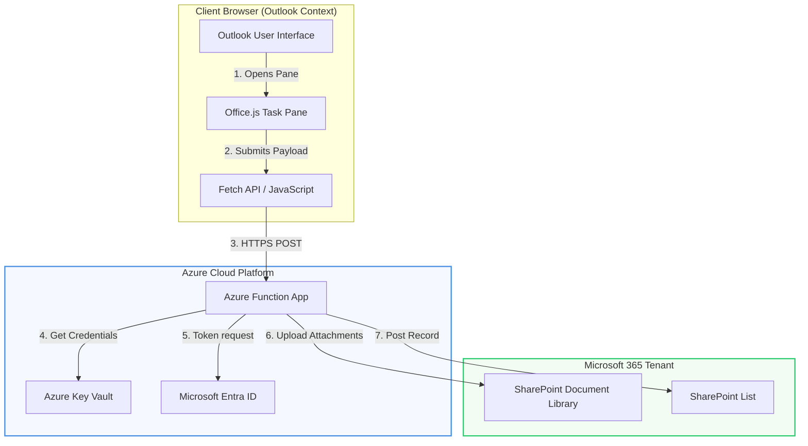

---

### Diagram 2: Application Architecture
Illustrates the structural classes, interfaces, and data models configured in the backend Function App.

```mermaid
classDiagram
    class SubmitRequestFunction {
        -ISubmissionService _submissionService
        -ApplicationSettings _appSettings
        +Run(HttpRequestData req) Task~HttpResponseData~
    }
    class ISubmissionService {
        <<interface>>
        +ProcessSubmission(SubmissionRequestDto request) Task~SubmissionResponseDto~
    }
    class SubmissionService {
        -IValidationService _validationService
        -ISharePointDocumentService _documentService
        -ISharePointListService _listService
        +ProcessSubmission(SubmissionRequestDto request) Task~SubmissionResponseDto~
    }
    class IValidationService {
        <<interface>>
        +ValidateRequest(SubmissionRequestDto request) Task~ValidationResult~
    }
    class ISharePointDocumentService {
        <<interface>>
        +CreateSubmissionFolder(Guid submissionId) Task~string~
        +UploadMultipleFiles(Guid submissionId, List~IFormFile~ files) Task~List~FileUploadResultDto~~
        +DeleteFolder(Guid submissionId) Task
    }
    class ISharePointListService {
        <<interface>>
        +CreateSubmissionItem(Guid submissionId, SubmissionRequestDto request, string folderUrl) Task~string~
    }
    class MultipartParser {
        <<static>>
        +ParseAsync(Stream body, string contentType, long maxFileSize) Task~SubmissionRequestDto~
    }

    SubmitRequestFunction --> ISubmissionService
    SubmissionService ..|> ISubmissionService
    SubmissionService --> IValidationService
    SubmissionService --> ISharePointDocumentService
    SubmissionService --> ISharePointListService
    SubmitRequestFunction ..> MultipartParser : Uses
```

---

### Diagram 3: Communication Diagram
Focuses on the network boundary crossings, transport protocols, and data formats.

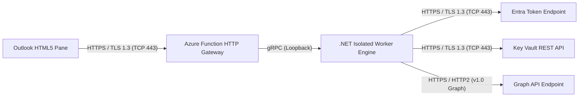

---

### Diagram 4: Authentication Diagram
Illustrates how the backend claims identities and exchanges them for API access tokens.

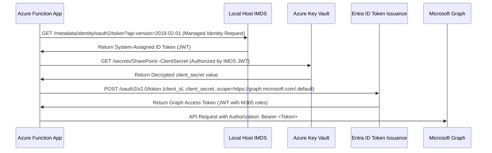

---

### Diagram 5: Dependency Injection Diagram
Visualizes service registration lifecycles and constructor instantiation rules inside `Program.cs`.

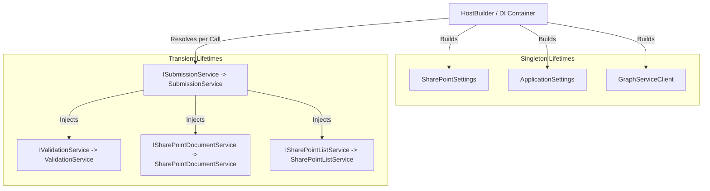

---

### Diagram 6: Azure Function Internal Architecture
Describes the process separation between the Function host and the Isolated Worker process.

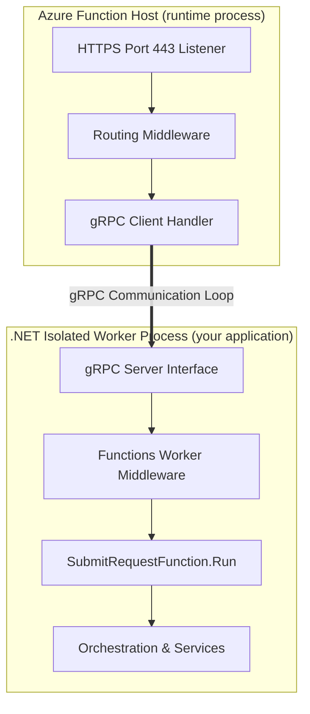

---

### Diagram 7: Service Layer Diagram
Details the sequence of processing from validation checks to SharePoint writes inside the service layers.

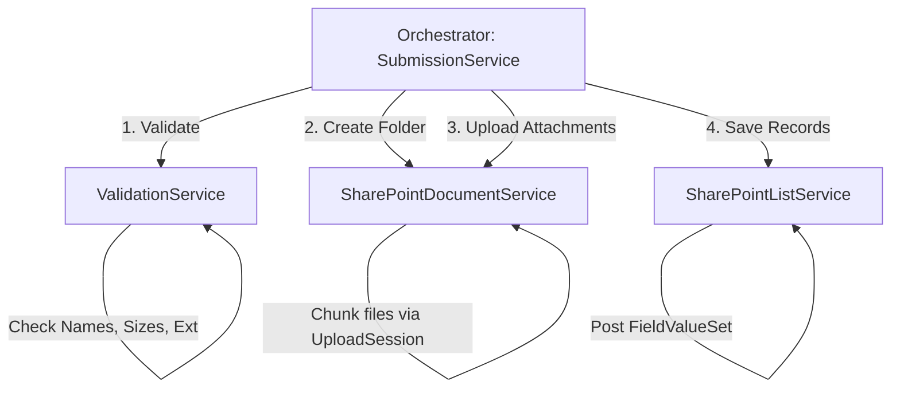

---

### Diagram 8: Microsoft Graph Communication Diagram
Illustrates how the GraphServiceClient routes requests through the SDK Request Adapter.

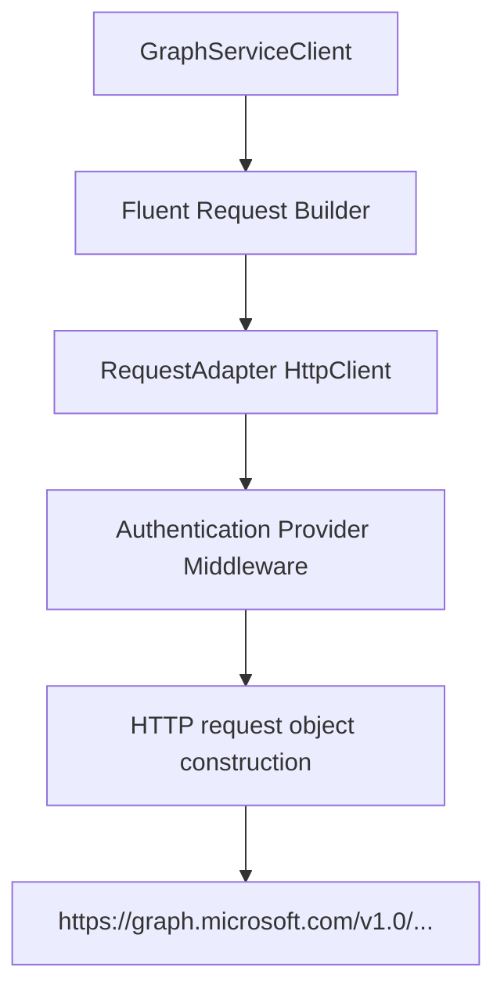

---

### Diagram 9: SharePoint Storage Diagram
Illustrates the physical data layout inside SharePoint Online.

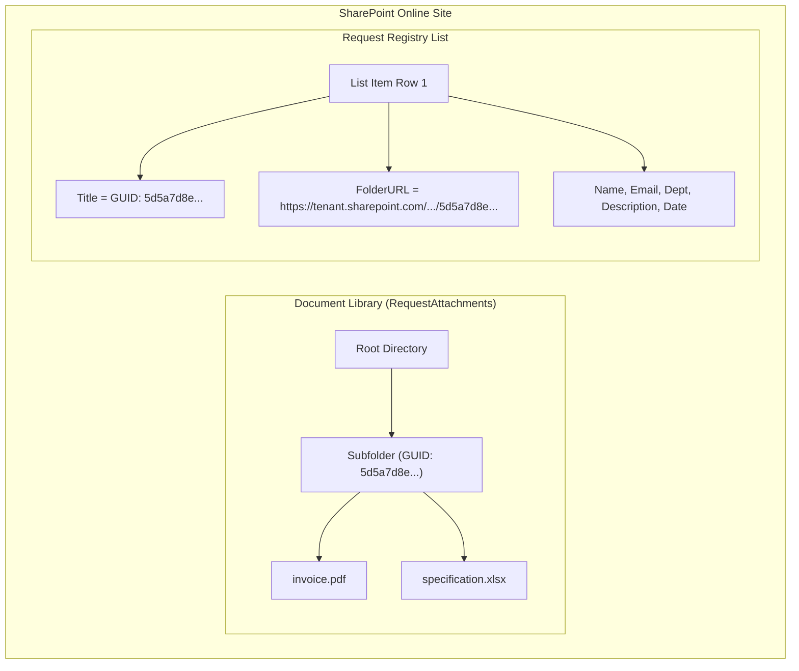

---

### Diagram 10: Complete Sequence Diagram
An end-to-end trace of a successful execution.

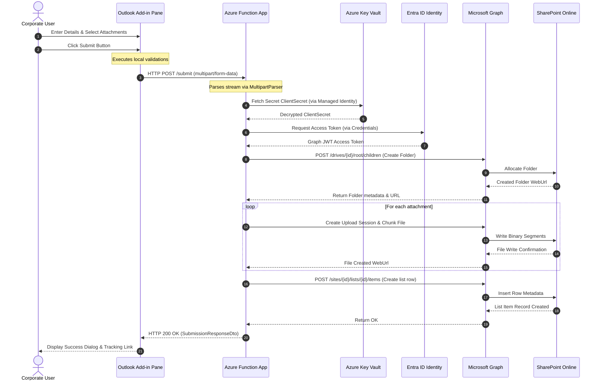

---

### Diagram 11: End-to-End Lifecycle Diagram
Shows states of the submission object as it moves through validation, file writing, list creation, and completion.

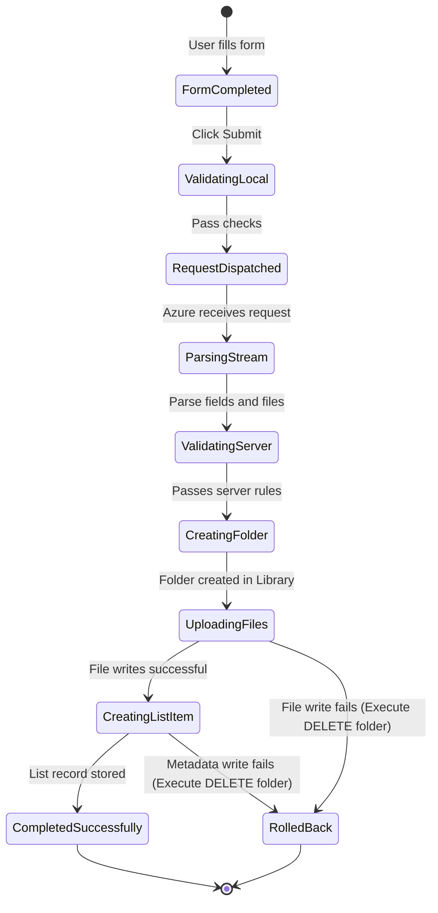

---

## 🔬 Architectural Level Analysis (Levels 1 to 12)

Here, we zoom into the technical realities of the application across 12 logical perspectives.

---

### Level 1: Business Flow
1. **Initiation**: A business user (e.g., in Finance or Operations) receives an email requesting action. They open the add-in to submit associated files and details for tracking.
2. **Metadata Processing**: The user supplies metadata (Name, Department, Description, Email). This metadata categorizes the request and routes assignments.
3. **Data Ingestion**: Up to 5 document attachments are selected to accompany the request.
4. **Audit Enforcement**: Submissions must go directly to a read-only corporate repository (SharePoint) with system-generated change trails, bypassing personal drives or shared file shares.
5. **Auditing**: Every record saved gets a GUID stamp. Administrative workers use the SharePoint List to process requests and follow the direct hyperlinks to review files.

---

### Level 2: Application Flow
The following ASCII block maps the logic boundaries across physical layers:

```
[ Outlook User Interface (Add-in Runtime) ]
  └── Local Validations (JS validation.js)
  └── Fetch payload generation
         │
    (POST over Public Internet / HTTPS)
         ▼
[ Azure Function Host (Kestrel Edge) ]
  └── CORS Handshake and Request Routing
  └── Spawn Isolated Process Thread
         │
    (gRPC Loopback)
         ▼
[ Azure Function Worker Process (.NET Core) ]
  └── Multipart parsing -> Stream validation
  └── Configuration Injection (IOptions / Settings)
  └── System Secret Retrieval (Key Vault Client)
  └── Client Credentials Token Fetch (Entra ID)
  └── Drive Item Folder Creation (Graph client)
  └── Large File Chunking (Graph upload session)
  └── List Item Metadata Posting (Graph client)
         │
    (M365 Backbone Routing)
         ▼
[ SharePoint Online Storage Engine ]
  └── Drive Engine allocation (Files)
  └── SQL Server / Content Database allocation (List items)
```

---

### Level 3: Component Flow
*   **`taskpane.html` & `taskpane.js`**: Host the HTML5 DOM and capture input click events. Handles reactive changes to the UI (e.g. loading animations, success/error modals).
*   **`validation.js`**: Enforces boundaries on the client prior to transmission. Checks that no file exceeds 10MB, attachments do not exceed 5, and file extensions match the whitelist.
*   **`api.service.js`**: Wraps the JavaScript Fetch API. Builds the `FormData` object and initiates the HTTP request.
*   **`SubmitRequestFunction.cs`**: Functions as the HTTP Entry point. Parses Content-Type, catches stream exceptions, and passes DTOs to the service boundary.
*   **`MultipartParser.cs`**: Reads the request stream line-by-line using a buffer to isolate field values and separate binary streams.
*   **`ValidationService.cs`**: Performs backend verification of input values (email structure regex, file extension matches, file size limits).
*   **`SubmissionService.cs`**: Orchestrates the multi-stage transaction: creates the folder, loops file uploads, creates list items, and runs error-recovery deletions (rollback).
*   **`SharePointDocumentService.cs`**: Interacts with the M365 Document Library drive. Resolves target paths, setups upload sessions, and deletes directories.
*   **`SharePointListService.cs`**: Connects to M365 Lists. Executes item creations, edits, and deletions.

---

### Level 4: Communication Flow
*   **Protocol**: HTTPS (HTTP/1.1 or HTTP/2) over TLS 1.3.
*   **TCP/IP Handshake**: The browser connects to the Azure Function App endpoint. The system verifies certificates (issued by Microsoft Azure RSA CA) and encrypts all headers, URLs, and bodies.
*   **CORS Preflight**: The browser sends an `OPTIONS` preflight request. The Azure gateway verifies that the source domain matches allowed domains, returning `Access-Control-Allow-Origin`.
*   **Multipart Encoding**: The browser streams data chunks separated by a boundary string, such as `----WebKitFormBoundary7MA4YWxkTrZu0gW`.
*   **gRPC Integration**: The Azure host runtime reads client TCP segments, copies them to memory, and streams them to the C# worker process via a local loopback gRPC channel.

---

### Level 5: Security Flow
1. **Network Encryption**: All data is encrypted in transit using TLS 1.3, mitigating man-in-the-middle attacks.
2. **Access Control (Least Privilege)**: The Azure Function does not execute under a user's delegated identity (which would require credentials or risky scopes). It uses a dedicated **App Registration** (Service Principal) with specific permissions:
   *   `Sites.ReadWrite.All` or folder-specific permissions on SharePoint.
3. **Secret Protection**: The app password is kept in Azure Key Vault. Access to Key Vault requires authentication via System-Assigned Managed Identity. The environment blocks outside network endpoints from fetching secrets.
4. **Input Sanitization**: File names are sanitized to prevent directory traversal attacks (`../../filename.txt`), and file extensions are verified against a whitelist.

---

### Level 6: Authentication Flow
This describes the path taken to obtain a Microsoft Graph Access Token:

```
[ Azure Function App ]
       │
       ├── (1) Calls IMDS loopback on local port: http://169.254.169.254
       ▼
[ Azure Instance Metadata Service ]
       │
       ├── (2) Validates host VM identity, requests token from Entra ID
       ▼
[ Microsoft Entra ID ] ──(Issues System Token)──► [ Key Vault Client ]
                                                       │
                                  (3) Fetch SharePoint client_secret
                                                       ▼
[ Azure Key Vault ] ────(Returns Secret)──────► [ Azure Function ]
                                                       │
                                  (4) Token Exchange: login.microsoftonline.com
                                                       ▼
[ Entra ID Token Issuance ] ──(Issues OAuth JWT Access Token)──► [ Graph client ]
```

The resulting JWT includes standard claims:
*   `iss` (Issuer): `https://sts.windows.net/{tenantId}/`
*   `aud` (Audience): `https://graph.microsoft.com`
*   `roles`: `[ "Sites.ReadWrite.All" ]`

---

### Level 7: Azure Function Internal Flow
1. **Request Reception**: The Azure Function Host (running in IIS or Kestrel) intercepts the TCP request on port 443.
2. **Middleware Processing**: The host maps the route `/api/submit` to the `SubmitRequestFunction` trigger.
3. **Process Communication**: The host packages headers and payload streams and pushes them over a loopback gRPC channel to the isolated C# process.
4. **Execution Injection**: The Worker runtime instantiates the `SubmitRequestFunction` and resolves constructor parameters using the DI container.
5. **Stream Parsing**: Code reads the body stream chunk-by-chunk using `MultipartReader` with an 80KB buffer, protecting the container from out-of-memory limits.
6. **Thread Allocation**: Async operations yield execution threads back to the system thread pool (`ThreadPool`), maximizing request concurrency.

---

### Level 8: Dependency Injection Flow
During application startup, `Program.cs` registers dependencies using the standard .NET Core service container:

*   **`AddSingleton<SharePointSettings>`**: Configuration mapping values are loaded from environment variables and held in memory for the life of the application.
*   **`AddSingleton<GraphServiceClient>`**: Initializes once. Reuse of the `GraphServiceClient` ensures that underlying HTTP connections are pooled, preventing TCP port exhaustion.
*   **`AddTransient<ISubmissionService, SubmissionService>`**: Instantiated on every call to isolate execution context and prevent cross-request contamination.
*   **`AddTransient<ISharePointDocumentService, SharePointDocumentService>`**: Injected transiently to ensure folder transactions remain thread-safe.

---

### Level 9: Microsoft Graph Flow
The C# SDK translates API queries into HTTP requests:
1. **Fluent URI Construction**: The statement `_graphServiceClient.Drives[id].Root.ItemWithPath(path).Children` constructs an internal request URI structure.
2. **Middleware Pipeline**: The request is routed through a middleware pipeline containing:
   *   **AuthenticationHandler**: Appends the `Authorization: Bearer <token>` header.
   *   **RetryHandler**: Implements exponential backoff when encountering rate-limiting errors (HTTP 429).
   *   **RedirectHandler**: Resolves temporary location moves.
3. **Upload Sessions**: For attachments, the SDK initiates a `CreateUploadSession` call. This generates a temporary upload URL. The SDK then reads the input stream in 320KB blocks and uploads them sequentially.

---

### Level 10: SharePoint Internal Flow
1. **Folder Provisioning**: SharePoint's Document Library engine creates a directory using the Submission GUID. SharePoint updates its internal path maps and assigns a unique `DriveItem` ID.
2. **WebUrl Generation**: SharePoint generates a specific web hyperlink to access the folder directly.
3. **List Record Ingestion**: SharePoint receives the List Item metadata POST. The list engine inserts a new record row, indexes the text fields, and binds the folder URL.
4. **Index and Search**: The search service crawls the new items, making them searchable by metadata (e.g., Name, Department) in real-time.

---

### Level 11: Complete Request Lifecycle
The path of an HTTP request:

```
[User Click] ──► [Local Form Validation] ──► [Fetch POST Multipart] 
      │
      ▼ (TLS 1.3 / TCP Port 443 Routing)
[Azure Edge Load Balancer] ──► [Functions Host Engine] 
      │
      ▼ (gRPC Serialization & Streaming)
[.NET Worker Process] ──► [MultipartParser reads stream] 
      │
      ▼ (DTO instantiation)
[ValidationService checks DTO] ──► [SubmissionService Orchestrates]
      │
      ▼ (Graph REST POST DriveItem)
[SharePoint Library Folder Created] ──► [Graph UploadSession Chunking]
      │
      ▼ (Graph REST POST ListItem)
[SharePoint List Row Inserted] ──► [HTTP Response Object Created]
```

---

### Level 12: Complete Response Lifecycle
1. **SharePoint Status**: SharePoint returns `201 Created` for the List Item metadata.
2. **List Service Conversion**: `SharePointListService` intercepts the JSON response, reads the new item ID, and passes it back to the orchestrator.
3. **Orchestrator Packaging**: `SubmissionService` maps results into a `SubmissionResponseDto` with `Success = true`, the created folder URL, and upload diagnostics.
4. **HTTP Transformation**: `SubmitRequestFunction` reads the response DTO, writes it as a JSON payload to `HttpResponseData`, and returns HTTP `200 OK`.
5. **gRPC Loopback**: The C# process serializes the response and pushes it back to the Host process.
6. **Network Transmission**: The Host sends the HTTP response payload to the client browser over the encrypted TCP connection.
7. **Client UI Render**: The JavaScript frontend parses the JSON, closes loading dialogs, and displays the tracking ID and folder hyperlink.

---

## 🔒 Microscopic Security Scenario: End-to-End Detail

This trace documents the security checkpoints crossed during a request submission:

1. **User Action**: The user clicks **Submit** in the Outlook Add-in pane.
2. **JS Payload Generation**: The browser's JavaScript engine packages the form inputs and files in memory.
3. **Network Encryption**: The browser sends an HTTP POST request. The network stack executes a TLS 1.3 handshake with the Azure Function App gateway, negotiating cryptographic ciphers (e.g., TLS_AES_256_GCM_SHA384) to encrypt data in transit.
4. **Azure Edge Processing**: Azure Front Door/App Service Gateway inspects the packet headers, terminates TLS, and checks firewall rules (WAF inspects against SQL Injection or Cross-Site Scripting).
5. **Routing to Host**: The host forwards the request payload to the Azure Function runtime.
6. **Authorization Level Check**: The host reads the function configuration. The route is set to `AuthorizationLevel.Anonymous` (meaning the endpoint is public, allowing the browser to submit directly without API keys, relying on Entra ID validation internally).
7. **Process Boundary gRPC**: The host forwards the raw stream over a secure local gRPC channel to the isolated C# worker process.
8. **Memory Shield Parsing**: `MultipartParser` processes the stream in 80KB buffers. If a file exceeds the 10MB limit, parsing aborts immediately to prevent resource exhaustion attacks.
9. **Credential Initialization**: The dependency engine starts the `GraphServiceClient`.
10. **Managed Identity Check**: The credentials engine calls the local IMDS link-local IP (`http://169.254.169.254/metadata/identity/oauth2/token`). The platform verifies that the request originates from the Function App container and returns a System token.
11. **Key Vault Decryption**: The app connects to Azure Key Vault over HTTPS and requests the secret `SharePoint--ClientSecret` using the IMDS token. Key Vault decrypts the secret and returns it.
12. **M365 Token Exchange**: The app sends an HTTP POST to `https://login.microsoftonline.com/{tenantId}/oauth2/v2.0/token` with the client ID and secret. Entra ID verifies the app registration and returns a JWT access token valid for 3600 seconds.
13. **Authorization Header Injection**: The SDK's authentication provider injects the header `Authorization: Bearer eyJhbGci...` into all Graph REST calls.
14. **SharePoint Authorization**: Microsoft Graph intercepts the REST calls, validates the signature and expiration of the JWT, checks that the app registration has list write permissions (`Sites.ReadWrite.All`), and writes the folders and list items to SharePoint.

---

## 📡 API Endpoints & Transport Protocols

### 1. Outlook Add-in to Azure Function Submit Endpoint
*   **Method**: `POST`
*   **URL**: `https://<YOUR_FUNCTION_APP>.azurewebsites.net/api/submit`
*   **Headers**:
    ```http
    Host: <YOUR_FUNCTION_APP>.azurewebsites.net
    User-Agent: Mozilla/5.0 (Windows NT 10.0; Win64; x64)...
    Accept: application/json
    Content-Type: multipart/form-data; boundary=----WebKitFormBoundary7MA4YWxkTrZu
    Origin: https://localhost:3000
    ```
*   **Body Payload**:
    ```text
    ------WebKitFormBoundary7MA4YWxkTrZu
    Content-Disposition: form-data; name="Name"

    Jane Doe
    ------WebKitFormBoundary7MA4YWxkTrZu
    Content-Disposition: form-data; name="Email"

    jane.doe@company.com
    ------WebKitFormBoundary7MA4YWxkTrZu
    Content-Disposition: form-data; name="Department"

    Finance
    ------WebKitFormBoundary7MA4YWxkTrZu
    Content-Disposition: form-data; name="Description"

    Quarterly financial sheets.
    ------WebKitFormBoundary7MA4YWxkTrZu
    Content-Disposition: form-data; name="Attachments"; filename="Q2_Report.pdf"
    Content-Type: application/pdf

    <BINARY_STREAM_OF_PDF_FILE_DATA>
    ------WebKitFormBoundary7MA4YWxkTrZu--
    ```
*   **Successful Response (HTTP 200 OK)**:
    ```json
    {
      "success": true,
      "submissionId": "5d5a7d8e-c90a-41e9-9a2c-d6a5d4f3b2c1",
      "message": "Submission completed successfully.",
      "folderUrl": "https://company.sharepoint.com/sites/site/Attachments/5d5a7d8e-c90a-41e9-9a2c-d6a5d4f3b2c1",
      "fileUploadResults": [
        {
          "fileName": "Q2_Report.pdf",
          "fileSize": 1048576,
          "uploadStatus": true,
          "fileUrl": "https://company.sharepoint.com/sites/site/Attachments/5d5a7d8e-c90a-41e9-9a2c-d6a5d4f3b2c1/Q2_Report.pdf",
          "errorMessage": null
        }
      ],
      "errors": []
    }
    ```
*   **Error Response (HTTP 400 Bad Request)**:
    ```json
    {
      "success": false,
      "submissionId": "5d5a7d8e-c90a-41e9-9a2c-d6a5d4f3b2c1",
      "message": "Validation failed.",
      "fileUploadResults": [],
      "errors": [
        "File 'virus.exe' has an unsupported extension. Allowed formats are: .pdf, .docx, .doc..."
      ]
    }
    ```

---

### 2. Under-the-Hood Graph API Calls

#### A. Resolve Target Drive (Document Library)
*   **HTTP Method**: `GET`
*   **URL**: `https://graph.microsoft.com/v1.0/sites/{siteId}/drives`
*   **Headers**:
    ```http
    Authorization: Bearer <Access_Token>
    Accept: application/json
    ```
*   **Response**: Returns list of drives. Used to resolve and cache the target Drive ID.

#### B. Create GUID Folder
*   **HTTP Method**: `POST`
*   **URL**: `https://graph.microsoft.com/v1.0/drives/{driveId}/root/children`
*   **Headers**:
    ```http
    Authorization: Bearer <Access_Token>
    Content-Type: application/json
    ```
*   **Body**:
    ```json
    {
      "name": "5d5a7d8e-c90a-41e9-9a2c-d6a5d4f3b2c1",
      "folder": {},
      "@microsoft.graph.conflictBehavior": "replace"
    }
    ```

#### C. Request File Upload Session
*   **HTTP Method**: `POST`
*   **URL**: `https://graph.microsoft.com/v1.0/drives/{driveId}/items/{folderId}:/Q2_Report.pdf:/createUploadSession`
*   **Headers**:
    ```http
    Authorization: Bearer <Access_Token>
    Content-Type: application/json
    ```
*   **Body**:
    ```json
    {
      "item": {
        "@microsoft.graph.conflictBehavior": "replace"
      }
    }
    ```
*   **Response**: Returns a unique `uploadUrl` to upload file slices.

#### D. Stream File Slice
*   **HTTP Method**: `PUT`
*   **URL**: `<UPLOAD_URL_RETURNED_FROM_SESSION_CREATE>`
*   **Headers**:
    ```http
    Content-Length: 327680
    Content-Range: bytes 0-327679/1048576
    ```
*   **Body**: `<RAW_BYTE_ARRAY_OF_SLICE>`

#### E. Post List Item Entry
*   **HTTP Method**: `POST`
*   **URL**: `https://graph.microsoft.com/v1.0/sites/{siteId}/lists/{listId}/items`
*   **Headers**:
    ```http
    Authorization: Bearer <Access_Token>
    Content-Type: application/json
    ```
*   **Body**:
    ```json
    {
      "fields": {
        "Title": "5d5a7d8e-c90a-41e9-9a2c-d6a5d4f3b2c1",
        "SubmissionId": "5d5a7d8e-c90a-41e9-9a2c-d6a5d4f3b2c1",
        "Name": "Jane Doe",
        "Email": "jane.doe@company.com",
        "Department": "Finance",
        "Description": "Quarterly financial sheets.",
        "FolderURL": "https://company.sharepoint.com/sites/site/Attachments/5d5a7d8e-c90a-41e9-9a2c-d6a5d4f3b2c1",
        "CreatedDate": "2026-07-06T17:29:22Z"
      }
    }
    ```

---

## 🚧 Transaction Rollback & Failure Recovery (Orchestration Guardrails)

The `SubmissionService` acts as a transaction coordinator. Since SharePoint does not support classic SQL-like distributed database transactions (XA transactions) spanning files and list items, the system uses custom compensation logic:

```
                  [ Begin Submission Transaction ]
                                 │
                     (Validate Form Properties)
                                 │
                       Create Unique Folder
                                 │
                ┌────────────────┴────────────────┐
          (Folder OK)                       (Folder Fails)
                │                                 │
       Upload Attachments                     [Abort / Return 500]
                │
        ┌───────┴───────┐
  (Uploads OK)    (Any Upload Fails)
        │               │
        │               ├──► Delete Folder (Rollback)
        │               ▼
        │         [Return 400 with Errors]
        │
   Create List Item
        │
  ┌─────┴─────────────┐
(List Item OK)  (List Item Fails)
  │                   │
[Success Response]    ├──► Delete Folder (Rollback)
                      ▼
                [Throw Error / Return 500]
```

### 1. File Upload Partial Failure
*   **Scenario**: A user uploads 3 attachments. The first 2 files upload successfully, but the 3rd upload fails (due to network timeout, format mismatch, or SharePoint rate limiting).
*   **Action**: The system detects a failed file upload status in the results list:
    ```csharp
    var failedUploads = fileUploadResults.Where(r => !r.UploadStatus).ToList();
    ```
*   **Rollback**: The application deletes the folder and all its contents by calling `DeleteFolder(submissionId)` to prevent orphaned files.
*   **Response**: The system returns a `400 Bad Request` containing a list of failed files and descriptions of the errors.

### 2. List Item Metadata Creation Failure
*   **Scenario**: All files upload successfully, but the SharePoint List is locked, misconfigured, or has custom schema validations that reject the metadata write.
*   **Action**: The call to `_listService.CreateSubmissionItem` throws an exception.
*   **Rollback**: The orchestrator catches the exception:
    ```csharp
    catch (Exception listEx)
    {
        _logger.LogError(listEx, "Failed to create SharePoint List metadata entry. Triggering folder rollback.");
        await _documentService.DeleteFolder(submissionId);
        throw;
    }
    ```
    This deletes the folder to keep SharePoint clean.
*   **Response**: Returns an HTTP `500 Internal Server Error` with a generic message, hiding raw SharePoint database parameters from the client.

### 3. Azure Key Vault Unavailable
*   **Scenario**: The Key Vault service is down or experiencing high latencies.
*   **Recovery**: The app logging records the exception. Without the client secret, the DI container cannot instantiate the `ClientSecretCredential`.
*   **Fallback**: If Key Vault is down, the code falls back to `DefaultAzureCredential()`:
    ```csharp
    logger.LogInformation("Initializing GraphServiceClient using DefaultAzureCredential.");
    var credential = new DefaultAzureCredential();
    return new GraphServiceClient(credential);
    ```
    This fallback uses the Function App's local system identity to connect directly to SharePoint (if SharePoint permissions are assigned directly to the Managed Identity).

---

## 📝 Walkthrough & Architecture Checklist for New Developers

Welcome to the team! Here is the checklist to verify your environment is working:
*   [ ] Read the [setup_guide.md](file:///e:/aditya/azure/OutlookRequestSolution/setup_guide.md) to install dependencies and run locally.
*   [ ] Ensure local settings are configured in [local.settings.json](file:///e:/aditya/azure/OutlookRequestSolution/RequestSubmissionFunctionApp/local.settings.json).
*   [ ] Run the Azure Function App: `func start` or press F5 in Visual Studio.
*   [ ] Run the Outlook Add-in server: `npm start` inside `OutlookAddin/` directory.
*   [ ] Use sideloading to add `manifest.xml` to Outlook Web or Desktop.
*   [ ] Open the Developer Tools console (F12) inside Outlook to trace API requests and network packets.
