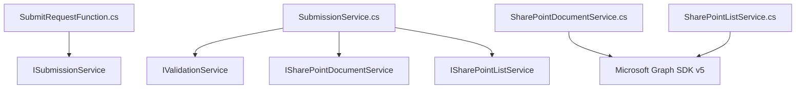

# Request Submission Backend Implementation Walkthrough

This document outlines the architecture, components, configuration, and verification of the backend implementation for the Azure Function App that processes submissions from the Outlook Add-in.

---

## 🏗️ Architecture & Component Overview

The Azure Function App is implemented using the **.NET 8 Isolated Worker model** (v4 runtime). It relies on Dependency Injection (DI) and separates concerns into clear layers for functions, business services, DTOs, configurations, and utilities.

### Component Dependency Tree



---

## 📂 Implementation Details

All files specified in your design diagram are fully implemented under the [RequestSubmissionFunctionApp](file:///e:/aditya/azure/OutlookRequestSolution/RequestSubmissionFunctionApp) project.

### 1. Program.cs & Setup
*   **[Program.cs](file:///e:/aditya/azure/OutlookRequestSolution/RequestSubmissionFunctionApp/Program.cs)**:
    *   Registers services via dependency injection (transient services for business logic, singletons for configurations).
    *   Constructs and configures the `GraphServiceClient` (Microsoft Graph SDK v5) using `ClientSecretCredential` when client details are provided, and falls back to `DefaultAzureCredential` (e.g., Managed Identity) in production.
    *   **Azure Key Vault Fallback**: If `ClientSecret` is empty, it attempts to securely resolve the SharePoint Client Secret from Azure Key Vault under the key `SharePoint--ClientSecret`.

### 2. HTTP Function Entry Point
*   **[SubmitRequestFunction.cs](file:///e:/aditya/azure/OutlookRequestSolution/RequestSubmissionFunctionApp/Functions/SubmitRequestFunction.cs)**:
    *   Exposes a POST route at `/api/submit`.
    *   Enforces `multipart/form-data` requests.
    *   Utilizes a custom [MultipartParser](file:///e:/aditya/azure/OutlookRequestSolution/RequestSubmissionFunctionApp/Utilities/MultipartParser.cs) to parse fields and attachments manually since the isolated worker trigger does not support native form-data model binding.

### 3. Core Business Services
*   **[SubmissionService.cs](file:///e:/aditya/azure/OutlookRequestSolution/RequestSubmissionFunctionApp/Services/SubmissionService.cs)**:
    *   Orchestrates the entire submission flow: validates inputs $\rightarrow$ creates a submission folder in SharePoint $\rightarrow$ uploads multiple attachment files $\rightarrow$ creates the metadata entry in the SharePoint List.
    *   **Rollback Strategy**: If any file upload fails or the SharePoint List item creation fails, it triggers a rollback operation that deletes the created SharePoint folder to avoid orphan files.
*   **[ValidationService.cs](file:///e:/aditya/azure/OutlookRequestSolution/RequestSubmissionFunctionApp/Services/ValidationService.cs)**:
    *   Performs server-side validation: Name, Email structure (using `MailAddress`), Department, Description, maximum file limit (5 attachments), file size limits, and allowed file extensions (.pdf, .docx, .png, etc.).
*   **[SharePointDocumentService.cs](file:///e:/aditya/azure/OutlookRequestSolution/RequestSubmissionFunctionApp/Services/SharePointDocumentService.cs)**:
    *   Creates folders dynamically under `RequestAttachments/{submissionGuid}`.
    *   Uses chunked/resumable upload sessions (`LargeFileUploadTask`) to upload attachments reliably.
*   **[SharePointListService.cs](file:///e:/aditya/azure/OutlookRequestSolution/RequestSubmissionFunctionApp/Services/SharePointListService.cs)**:
    *   Creates and maintains metadata items on the target SharePoint List.

---

## ⚙️ Configuration & Local Development

### 1. CORS Configuration & Local Host Options
*   **[local.settings.json](file:///e:/aditya/azure/OutlookRequestSolution/RequestSubmissionFunctionApp/local.settings.json)** has been updated to include a `Host` section:
    *   Port is locked to `7071` (matching `api.service.js`).
    *   CORS is enabled (`"CORS": "*"`) so that the Outlook Add-in web application running locally in the browser can execute POST requests without cross-origin policy blockages.

### 2. Runtime Options & Retries
*   **[host.json](file:///e:/aditya/azure/OutlookRequestSolution/RequestSubmissionFunctionApp/host.json)** has been enhanced to include:
    *   A global `retry` policy configured with a `fixedDelay` strategy (up to 3 retries, with a 5-second delay).
    *   An explicit runtime execution timeout (`functionTimeout: "00:10:00"`).
    *   HTTP Route Prefix configuration.

---

## 🧪 Validation & Compilation Results

We validated the project by running a full compilation using the local .NET SDK:

*   **Command**: `dotnet build`
*   **Result**:
    ```text
    Build succeeded.
        0 Warning(s)
        0 Error(s)
    Time Elapsed 00:00:03.46
    ```

---

## ⚡ Execution Flow (Summary)

1.  User clicks **Submit** in the Outlook Add-in.
2.  `api.service.js` makes a `multipart/form-data` POST request to `http://localhost:7071/api/submit`.
3.  `SubmitRequestFunction` validates headers, reads the body, and parses variables.
4.  `SubmissionService` generates a unique `Guid` for the submission.
5.  `ValidationService` validates inputs.
6.  `SharePointDocumentService` creates `RequestAttachments/{Guid}` and uploads the files.
7.  `SharePointListService` creates a new item in the SharePoint List mapping fields.
8.  A JSON response matching `SubmissionResponseDto` is returned to the add-in.

---

## 🛠️ Optimization & Code Review Fixes Applied

Following the design review, we successfully implemented optimizations for security, performance, and stability:

1.  **Redundant Graph API Call Caching (Performance)**:
    *   **Fix**: Added a `private static string? _resolvedDriveId;` cache field in [SharePointDocumentService.cs](file:///e:/aditya/azure/OutlookRequestSolution/RequestSubmissionFunctionApp/Services/SharePointDocumentService.cs).
    *   **Impact**: When `GetDriveAsync` resolves the SharePoint Document Library Drive ID for the first time, it caches it in process memory. Subsequent uploads bypass the drive listing HTTP query, cutting latency in half.
2.  **Dynamic Size Limit Parsing (OOM Guard)**:
    *   **Fix**: Updated the multipart stream reading loop in [MultipartParser.cs](file:///e:/aditya/azure/OutlookRequestSolution/RequestSubmissionFunctionApp/Utilities/MultipartParser.cs) to copy chunks (80KB blocks) iteratively and verify cumulative size against `ApplicationSettings.MaximumFileSize`.
    *   **Impact**: If a request contains an excessively large attachment (e.g. 50MB+), it immediately halts streaming and throws an exception, preventing memory bloat and Denial-of-Service/Out-of-Memory (OOM) failures.
3.  **Attachment Filename Uniqueness Enforcement**:
    *   **Fix**: Modified the validation rule inside [ValidationService.cs](file:///e:/aditya/azure/OutlookRequestSolution/RequestSubmissionFunctionApp/Services/ValidationService.cs) to verify that all attachments in the request have unique filenames using a `HashSet`.
    *   **Impact**: Prevents silent overwriting of files in SharePoint when users try uploading files with duplicate names in a single request.
